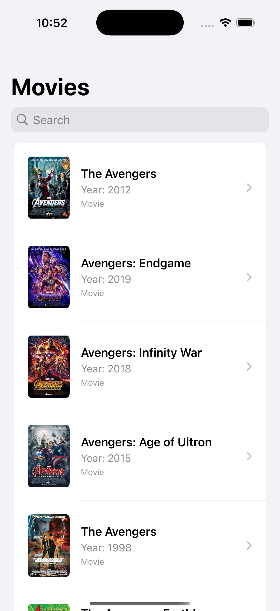
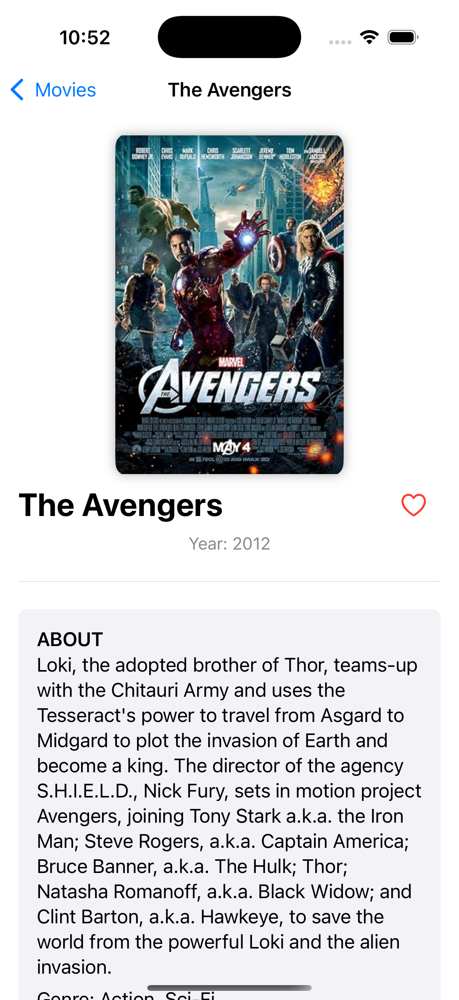

# 🎬 Movie Searcher

This app is a Movie Searcher, it is a SwiftUI application that allows users to search for movies using the OMDb API. It displays search results in a list, supports infinite scrolling for pagination, caches movie posters efficiently, and navigates to a detailed view for each movie.

---

## ✨ Features

- 🔍 **Search** movies by title
- 🧾 **Paginated results** with lazy loading
- 🖼️ **Poster caching** using `URLCache`
- 📱 **SwiftUI-native interface** (no UIKit)
- 📡 Fetch movie data by IMDb ID for **detail view**
- 🚨 Graceful **error handling** (e.g. no results, bad network)
- 🧭 Navigation to detail view using `NavigationLink`

---

## 🛠️ Requirements

- iOS 15.0+
- Xcode 14+
- Swift 5.6+

---

## 🔧 Setup

1. Clone the repository:

   ```bash
   git clone https://github.com/edurd/movie-searcher.git
   cd movie-searcher
   ```

2. Open the project in Xcode:

   ```bash
   open movie-searcher.xcodeproj
   ```

3. Run the project on the simulator or a real device.

---

## 📦 API

This app uses the [OMDb API](https://www.omdbapi.com/).

* You'll need an API key to access movie data.
* Insert your API key into the constants file:

```swift
struct Constants {
    static let apiKey = "API_KEY"
    static let baseURL = "http://www.omdbapi.com/?apikey=\(Constants.apiKey)"
}

```

---

## 🧠 Architecture

* MVVM (Model-View-ViewModel)
* Networking via `URLSession`
* Image caching via `URLCache`
* Async/await support where appropriate

---

## 📸 Screenshots

### 🔍 Search View


### 🎞️ Movie Detail View

---

## 🙌 Contributions

Pull requests are welcome. For major changes, please open an issue first to discuss what you’d like to change.


